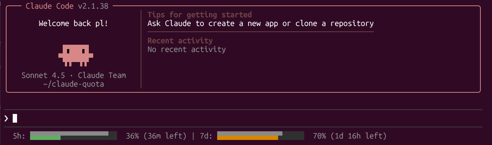
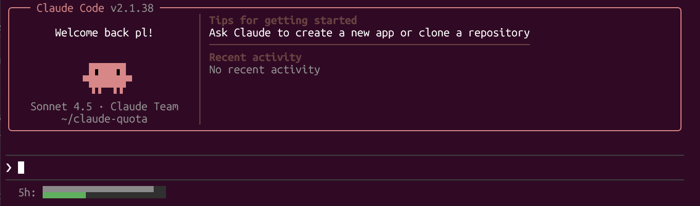
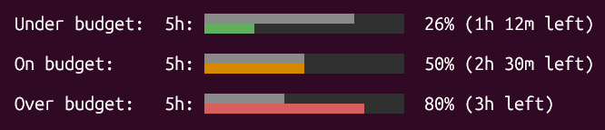
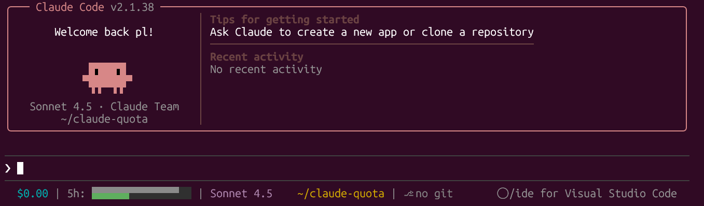

# claude-quota

Fast statusline showing Claude Code subscription quota usage — 5-hour block and 7-day weekly limits.

## Usage

Add to `~/.claude/settings.json`:

```json
{
  "statusline": {
    "type": "command",
    "command": "npx -y claude-quota"
  }
}
```

**Verbose mode (show percentage and time remaining):**



```json
{
  "statusline": {
    "type": "command",
    "command": "npx -y claude-quota -v"
  }
}
```

**Single section example (5-hour block only with `--no-weekly`):**



**Bar visualization:** Top half shows time elapsed in the block, bottom half shows usage consumed. Green = under budget, yellow = on budget, red = over budget.



## ccstatusline Integration

Use as a Custom Command Widget with [ccstatusline](https://github.com/sirmalloc/ccstatusline). Enable "preserve colors" in your widget config.



## Installation

Optional — install globally to avoid npx overhead:

```bash
npm install -g claude-quota
```

Then use `"command": "claude-quota"` in settings.json.

## Options

```
--no-block           Hide 5-hour block gauge
--no-weekly          Hide 7-day weekly gauge
--cache-ttl <SECS>   Cache TTL in seconds [default: 30]
--credentials <PATH> Custom credentials file path
--bar-width <N>      Bar width in characters [default: 20]
-v, --verbose        Show percentage and time remaining
-h, --help           Show this help
```

## License

MIT
